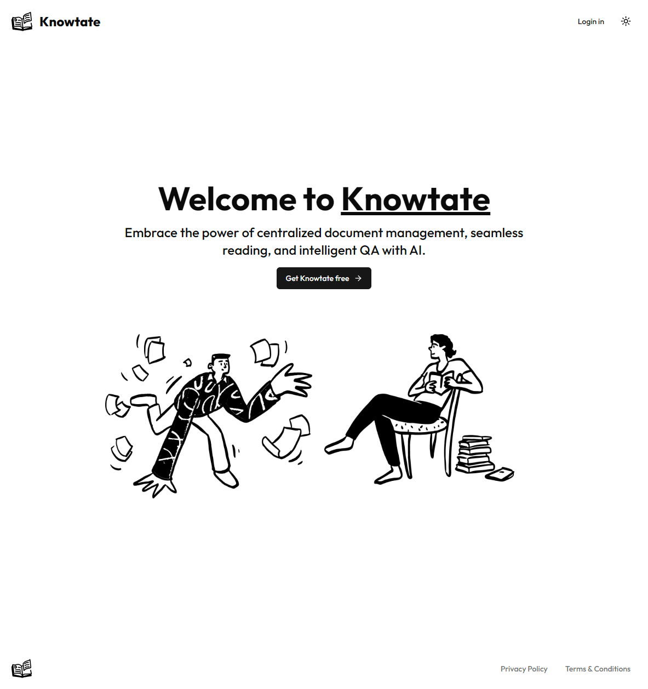
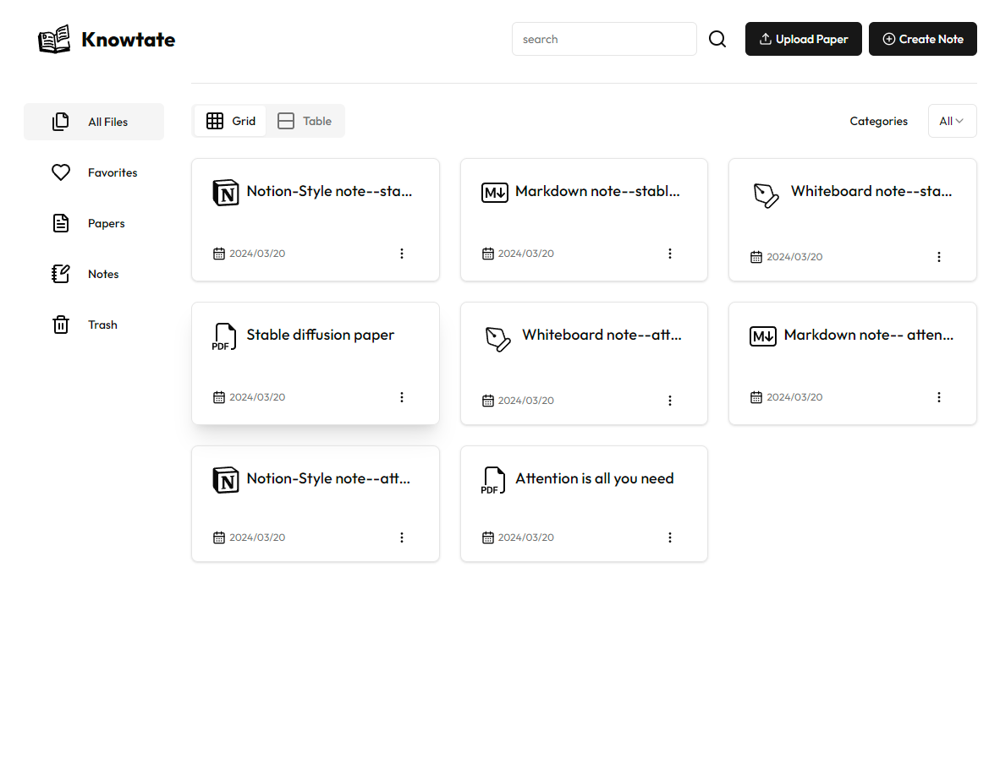
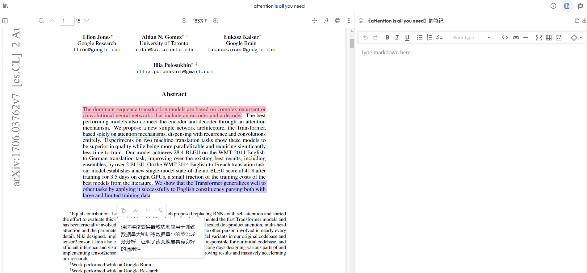
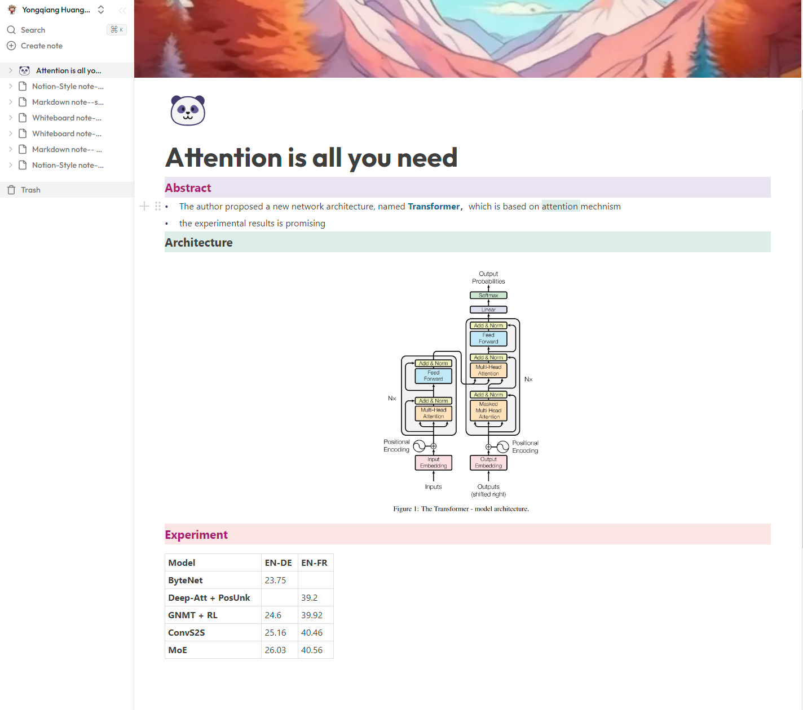
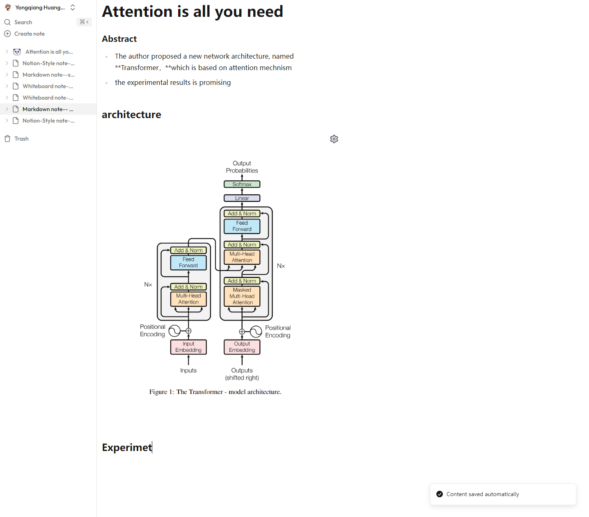
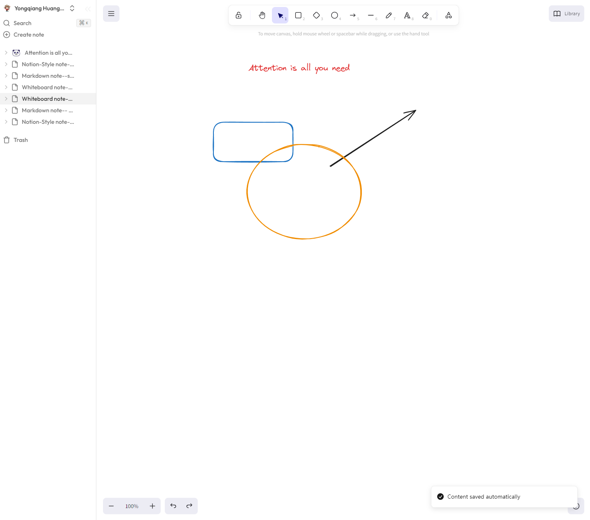
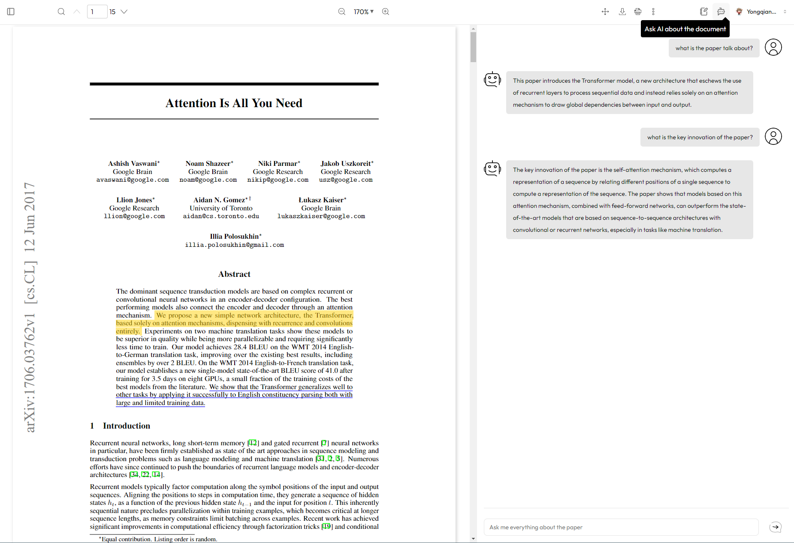
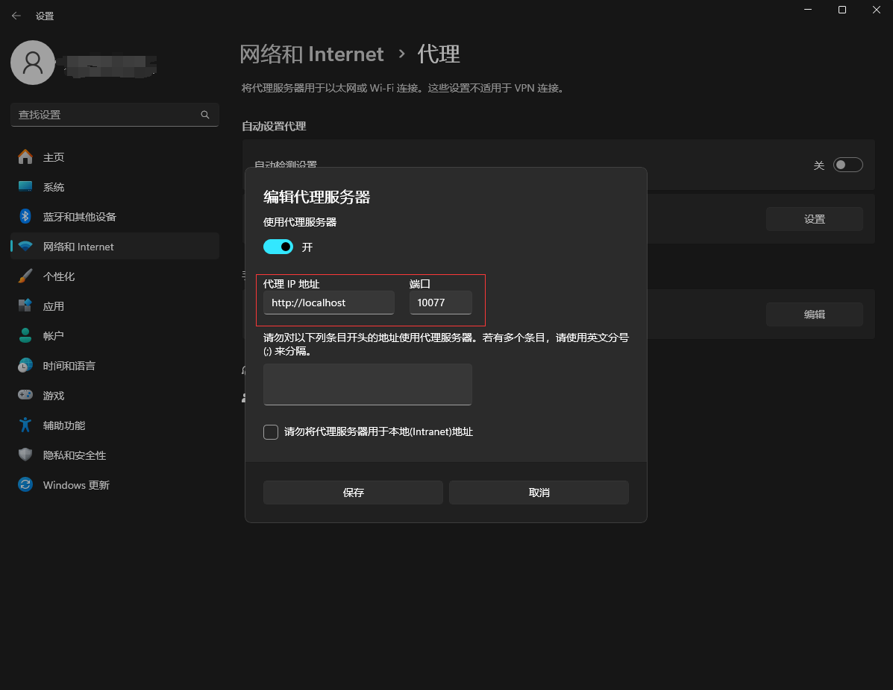

<div align="center">

#  Knowtate 

</div>

<p align="center">
  <strong>Empowering Research Excellence</strong><br>
  Knowtate is a scientific research assistant app offering a suite of features for literature reading, management, and intelligent QA with AI. Embrace the power of centralized document control, seamless reading, and intelligent QA with AI of your document—all within a single, streamlined application.
</p>

<p align="center">
  
</p>

> [!IMPORTANT]
> You can try Knowtate online at: https://knowtate.online or deploy it on your own local enviroment by following the instructions of [Quick Start Part](#quick-start).

## Features

### Literature Management and Reading
Upload and manage your research papers with a central repository backed by object storage service. This service can be self-hostable or various cloud storage solutions like AWS S3. Enjoy an online PDF reader that enhances your literature reading experience.

<p align="center">
  
  
</p>

### Diverse Note-Taking Styles:
Knowtate caters to your note-taking preferences with three unique styles, each designed to complement different aspects of your research workflow.

#### Notion-Styled Rich Text Editor:
For those who appreciate the flexibility and aesthetic of Notion, our rich text editor offers similar functionalities. Utilize slash commands (/) to seamlessly switch between text block styles, supporting multi-level headings, tables, ordered and unordered lists, images, and more.

<p align="center">
  
</p>

#### Markdown Editor:
For the markdown aficionados, the Markdown Editor provides a straightforward, text-focused interface. This allows for efficient writing and formatting with the simplicity and power of markdown syntax—perfect for those who prefer keyboard-centric controls and clean, exportable content.

<p align="center">
  
</p>

#### Excalidraw Whiteboard:
Unleash your creativity with the Excalidraw whiteboard, a digital canvas for freeform drawing, diagramming, and visual brainstorming. This tool is excellent for creating and sharing quick sketches, complex diagrams, or visual notes that complement your research.


<p align="center">
  
</p>

### Intelligent Paper Q&A:
Powered by a RAG-based intelligent Q&A system, Knowtate allows you to inquire about any aspect of your papers. Customize your dialogue models, vectorization models, and vector databases to suit your needs. Currently supporting OpenAI ChatGPT and OpenAI Embeddings for insightful interactions.

<p align="center">
  
</p>

### More Features on the Horizon:
Development is ongoing for additional features to enhance your research experience even further.

## Quick Start

### Run Locally

#### 1. Clone the Repository Locally
```bash
# Navigate to your desired path
cd /your/path/
git clone https://github.com/tsmotlp/knowtate.git
```

#### 2. Configure Environment Variables
```bash
cd /your/path/knowtate
cp .env.example .env
# Change `.env.example` to `.env` and update the following variables in `.env`:

# Deployment used by `npx convex dev`
CONVEX_DEPLOYMENT=
NEXT_PUBLIC_CONVEX_URL=
NEXT_PUBLIC_CLERK_PUBLISHABLE_KEY=
CLERK_SECRET_KEY=

MINIO_ENDPOINT=
MINIO_ACCESS_KEY=
MINIO_SECRET_KEY=

OPENAI_API_KEY=
PROXY_URL=

```
> Knowtate uses convex as backend database to store file meta data, please visit [convex website](https://www.convex.dev/) to get `CONVEX_DEPLOYMENT` and `NEXT_PUBLIC_CONVEX_URL`

> Knowtate uses clerk for authentication, please visit [clerk website](https://clerk.com/) ot get `NEXT_PUBLIC_CLERK_PUBLISHABLE_KEY` and `CLERK_SECRET_KEY`

> For Windows users, find your network proxy address in Settings -> Network and Internet -> Manual proxy setup -> Edit. Enter the server information in the format http://localhost:10077 as your PROXY_URL.
<p align="center">
  
</p>

> For Linux users, determine your network proxy address with:

```bash
echo $HTTP_PROXY
``` 

#### 3. Install and run minio
Download MinIO server binaries compatible with your OS from the [MinIO Download Page](https://min.io/download).
> For Windows users, you can open Powershell and enter the following commands:
```bash
PS> Invoke-WebRequest -Uri "https://dl.min.io/server/minio/release/windows-amd64/minio.exe" -OutFile "C:\minio.exe"
PS> setx MINIO_ROOT_USER admin
PS> setx MINIO_ROOT_PASSWORD password
PS> C:\minio.exe server F:\Data --console-address ":9001"
```

> For Linux users, you can open Terminal and enter the following commands:
```bash
wget https://dl.min.io/server/minio/release/linux-amd64/minio
chmod +x minio
MINIO_ROOT_USER=admin MINIO_ROOT_PASSWORD=password ./minio server /mnt/data --console-address ":9001"
```

> Similar to the MacOS users:
```bash
curl --progress-bar -O https://dl.min.io/server/minio/release/darwin-amd64/minio
chmod +x minio
MINIO_ROOT_USER=admin MINIO_ROOT_PASSWORD=password ./minio server /mnt/data --console-address ":9001"
```

After setting up, MinIO server listens on port :9000, and you can manage your storage through  `http://localhost:9001`.

#### 4. Install Depedencies:
```bash
> cd  path/to/knowtate
> npm install # or pnpm install or yarn
```

#### 5. Run Knowtate:
```bash
> cd  path/to/knowtate
> npm run dev # or pnpm run dev or yarn dev
```
Access Knowtate at http://localhost:3000 and delve into your personalized academic research experience.

### Run with Docker

#### 1. Install Docker
For Windows: Download Docker Desktop and follow the [official guide](https://docs.docker.com/engine/install/) or search for an installation tutorial.

#### 2. Clone the Repository Locally
```bash
# Navigate to your desired path
cd /your/path/
git clone https://github.com/tsmotlp/knowtate.git
```

#### 3. Configure Environment Variables
```bash
cd /your/path/knowtate
cp .env.example .env
# Change `.env.example` to `.env` and update the following variables in `.env`:

# Deployment used by `npx convex dev`
CONVEX_DEPLOYMENT=
NEXT_PUBLIC_CONVEX_URL=
NEXT_PUBLIC_CLERK_PUBLISHABLE_KEY=
CLERK_SECRET_KEY=

MINIO_ENDPOINT=
MINIO_ACCESS_KEY=
MINIO_SECRET_KEY=

OPENAI_API_KEY=
PROXY_URL=
```

#### 4. Build the Image
```bash
docker-compose build --no-cache
```

#### 5. Start the Application
```bash
docker-compose up
```

#### 6. Stop the Application
```bash
docker-compose down
```

## Contributing
Contributions through code, issue reporting, or suggestions are welcomed. Please refer to our [Contribution Guide](https://chat.openai.com/c/CONTRIBUTION).

## License
Knowtate is licensed under GPL-3.0. For details, please refer to the [LICENSE](https://chat.openai.com/c/LICENSE) file.