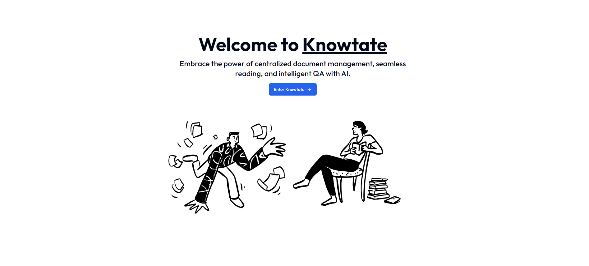
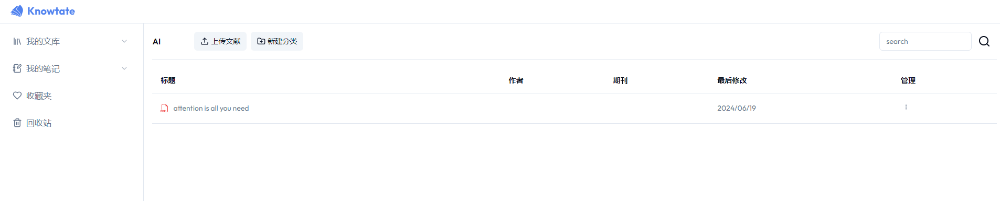
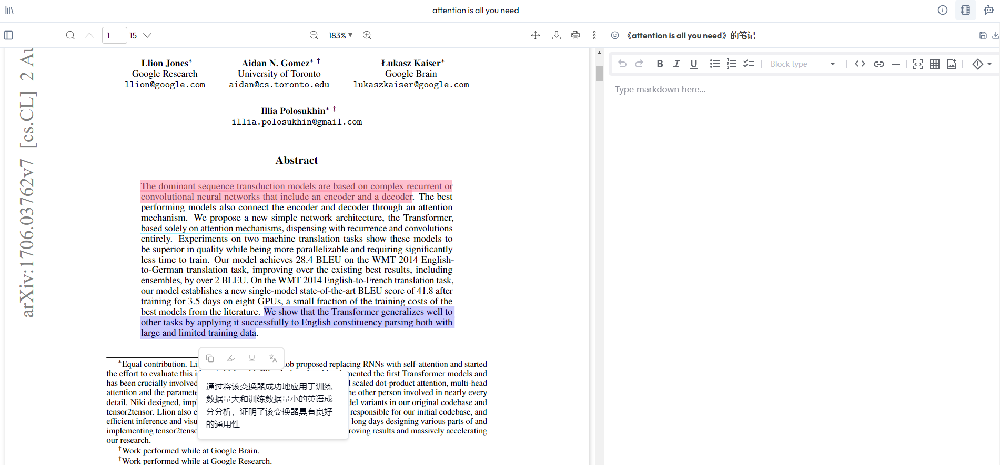
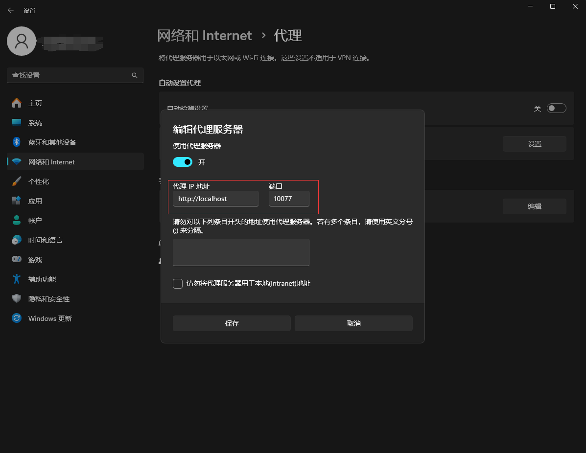

<div align="center">

#  Knowtate 

</div>

<p align="center">
  <strong>Empowering Research Excellence</strong><br>
  Knowtate is a scientific research assistant app offering a suite of features for literature reading, management, and intelligent QA with AI. Embrace the power of centralized document control, seamless reading, and intelligent QA with AI of your document—all within a single, streamlined application.
</p>

<p align="center">
  
</p>

> [!NOTE]
> You can try Knowtate online at: https://knowtate.online or deploy it on your own local enviroment by following the instructions of [Quick Start Part](#quick-start).

## Features

### Literature Management and Reading
Upload and manage your research papers with a central repository backed by object storage service. This service can be self-hostable or various cloud storage solutions like AWS S3. Enjoy an online PDF reader that enhances your literature reading experience.

<p align="center">
  
  
</p>

### Markdown Editor:
For the markdown aficionados, the Markdown Editor provides a straightforward, text-focused interface. This allows for efficient writing and formatting with the simplicity and power of markdown syntax—perfect for those who prefer keyboard-centric controls and clean, exportable content.

### Intelligent Paper Q&A:
Powered by a RAG-based intelligent Q&A system, Knowtate allows you to inquire about any aspect of your papers. Customize your dialogue models, vectorization models, and vector databases to suit your needs. Currently supporting OpenAI ChatGPT and OpenAI Embeddings for insightful interactions.

### More Features on the Horizon:
Development is ongoing for additional features to enhance your research experience even further.

## Quick Start

### Run Locally

#### 1. Clone the Repository Locally
```bash
# Navigate to your desired path
cd /your/path/
git clone https://github.com/tsmotlp/knowtate.git
```

#### 2. Configure Environment Variables
```bash
cd /your/path/knowtate
cp .env.example .env
# Change `.env.example` to `.env` and update the following variables in `.env`:

# Deployment used by `npx convex dev`
DATABASE_URL="file:./researcher.db"

BAIDU_TRANSLATION_APPID=
BAIDU_TRANSLATION_SECRET_KEY=

OPENAI_API_KEY=
PROXY_URL=

```

> For Windows users, find your network proxy address in Settings -> Network and Internet -> Manual proxy setup -> Edit. Enter the server information in the format http://localhost:10077 as your PROXY_URL.
<p align="center">
  
</p>

> For Linux users, determine your network proxy address with:

```bash
echo $HTTP_PROXY
``` 

#### 4. Install Depedencies:
```bash
> cd  path/to/knowtate
> npm install # or pnpm install or yarn
```

#### 5. Run Knowtate:
```bash
> cd  path/to/knowtate
> npm run dev # or pnpm run dev or yarn dev
```
Access Knowtate at http://localhost:3000 and delve into your personalized academic research experience.

## Copyright and License
The contents of this repository are licensed under the [MIT License](https://github.com/tsmotlp/knowtate/blob/master/LICENSE). We respect and adhere to the copyright and usage permissions of each paper and resource.

## Contact Information
For any questions or suggestions, please contact us through the following:

- [Submit an Issue](https://github.com/tsmotlp/knowtate/issues)
- Email: yqhuang2912@gmail.com